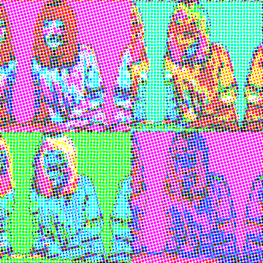

# Warholizer 🎨

Generate Andy‑Warhol–style pop‑art grids from any photograph with a single command‑line call.

<p align="center">
  
</p>

## ✨ Why another “Warhol filter”?

Instead of a one‑click Photoshop action, **Warholizer** breaks the look down into discrete, reproducible steps that mirror the original silkscreen process. Each stage is exposed as a CLI switch so you can mix, match and script your own flavour of pop art.

---

## 🏗️  Which Warhol elements are reproduced — and how

| Original silkscreen trait                  | Digital analogue in *warholizer.py*                                                             | How to tweak                       |
| ------------------------------------------ | ----------------------------------------------------------------------------------------------- | ---------------------------------- |
| **Limited, high‑saturation palette**       | k‑means (or fixed threshold) colour quantisation → map to random HSV palette (`random_palette`) | `--poster_k`, `--face_k`, `--bg_k` |
| **Crisp black line work**                  | Auto‑Canny + dilation → binary mask; lines forced to `#000`                                     | `--line_thickness`                 |
| **Flat colour blocks**                     | Posterised image multiplied by line mask                                                        | implicit                           |
| **Mis‑registration between colour passes** | Per‑channel random affine shift (`misregister`)                                                 | `--misregister`                    |
| **Halftone dots**                          | CMY rotated dot‑screen (`halftone`)                                                             | `--halftone`                       |
| **Repetition & variation**                 | N × M tiling with new palette each panel                                                        | `--rows`, `--cols`, RNG seed       |
| **Subject‑centric framing**                | Face detection → auto‑crop to bust shot                                                         | `--no_auto_crop` to disable        |

> **Not reproduced:** hand‑applied imperfections, paint drips, metallic inks. PRs welcome.

---

## 🚀 Quick start

```bash
# 1.  Install deps (Python ≥3.8)
pip install opencv-python pillow numpy

# 2.  Run on your photo
python warholizer.py input.jpg -o warhol.png \
    --rows 2 --cols 2 \
    --poster_k 8 --halftone --misregister
```

The script prints a `Saved → /path/to/warhol.png` confirmation.

### Face‑aware version

```bash
python warholizer.py selfie.jpg -o pop_selfie.png \
    --face_k 12 --bg_k 4 \
    --halftone --misregister --seed 42
```

If no face is detected the code falls back to single‑depth mode automatically.

---

## 🔧 CLI reference

```text
positional arguments:
  input                 input image file

optional arguments:
  -o, --output PATH     output path (default: warhol_out.png)
  --rows N              grid rows (default: 2)
  --cols N              grid columns (default: 2)
  --size PX             panel side before tiling (default: 512)
  --poster_k K          colours when not splitting face/bg (default: 6)
  --face_k K            face‑region colours (enable split if >0)
  --bg_k K              background colours (paired with --face_k)
  --halftone            add CMY dot‑screen
  --misregister         randomly offset RGB layers (±4 px)
  --line_thickness PX   dilation size for black lines (default: 2)
  --no_auto_crop        disable face‑centric crop/zoom
  --seed S              set RNG seed for reproducibility
```

---

## 🛠️  Internals in 4 steps

1. **Pre‑process** → square‑pad, optional Gaussian blur, resize.
2. **Line extraction** → auto‑Canny → dilation → invert mask.
3. **Colour posterise**

   * Single‑depth: whole image k‑means `K` clusters.
   * Dual‑depth: face/bg masks quantised separately (`face_k`, `bg_k`).
4. **FX & layout** → mis‑registration → halftone → tile grid.

See `warholizer.py` for fully‑commented code.

---

## 🗺️  Roadmap

### Short‑term (v0.2.x)

* **Plugin FX architecture** – supply `--fx myfilter.py` to chain custom post‑effects.
* **GPU k‑means** via cuML for faster batch renders.
* **Config file** (`warholizer.toml`) to save favourite palettes & CLI presets.
* **Visual regression tests** – CI renders golden sample set on every PR.

### Mid‑term (v0.3.x)

* **Desktop GUI** (Tk or Electron) for drag‑and‑drop usage.
* **Animated output** – cycle palettes per frame to produce GIF/MP4 loops.
* **Metallic & glitter inks** – texture‑based overlays with normal‑map lighting.

### Long‑term (v1.0)

* **WebAssembly build** to run entirely in the browser.
* **Learned ink‑bleed model** – lightweight style‑transfer fine‑tuned on Warhol catalogue.
* **Preset marketplace** so the community can share palettes, halftone patterns, etc.

---

## 📜  License

MIT — do whatever you want, but attribution appreciated.

## 🙌  Credits

*Andy Warhol* for perpetual inspiration. Built with OpenCV, Pillow, NumPy.
